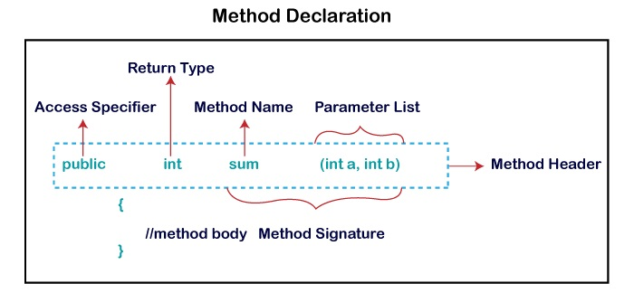
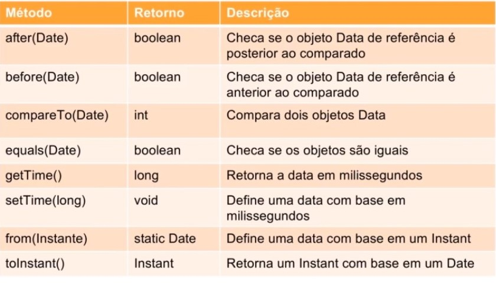
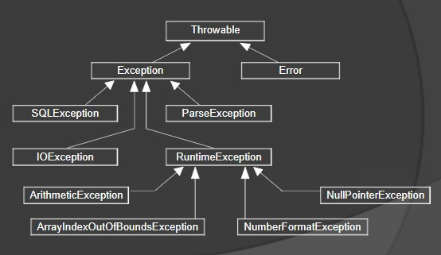
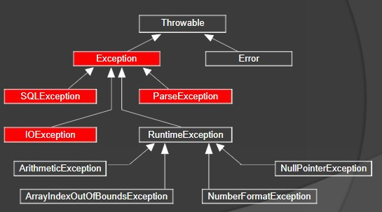
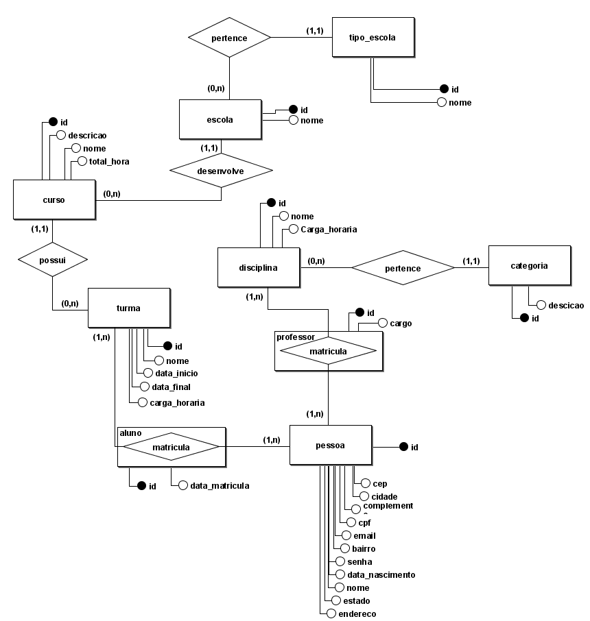

# Desenvolvimento básico em java


O fato de você utilizar na sua aplicação a orientação a objeto não quer dizer que não é não é uma aplicação estruturada.

**Simula 67** - primeira linguagem orientada a objetos 

Como identificar uma **função utilitária**?

Devem ser feitas as seguintes perguntas:

Ela consegue se resolver por ela mesma, sem depdendências externas?
Os parãmetros de entrada são simples e diretos?
o resultado de saída também é simples e direto?

Exemplo:
Validação de CPF ou CNPJ (Entrada: o cpf | Saída: Verdadeiro ou Falso).


Os conceitos são muito importantes!

**Classe e Objeto** -

Diferença entre Classes e Objetos: Antes de um objeto ser criado, devemos definir quais serão suas propriedades e métodos, tais definições são realizadas através de uma classe.

A partir de uma **classe**, podemos construir objetos na memória do computador que executa a nossa aplicação. Usando uma analogia, uma classe funciona como uma "receita" para criar objetos. Inclusive, vários objetos podem ser criados a partir de uma única classe.

São estruturas de dados atraves dos quais objetos podem ser instanciados

**Associação de Classes** - Quando utilizamos uma classe dentro de outra classe.

**Herança** - É a utilização de uma classe base, fazendo com que uma nova classe tenha todos os atributos e funções da classe pai, mais as suas próprias.

**Encapsulamento** - É a possibilidade de proteger alguns dados ou funcionalidades da classe, não permitindo que seus consumidores possam acessá-la.

**Polimorfismo** - Capacidade de referenciar objetos construídos por classes específicas como objetos de uma classe genérica, desde que essa classe genérica respeite a hierarquia em questão. Aqui podemos criar funções que terão o mesmo nome, mas que podem ter diferentes processamentos, implementações ou mesma classe o mesmo nome e diferentes entradas.

**Abstração** - é a habilidade de concentrar-se nos aspectos essenciais de um domínio, ignorando características menos importantes ou acidentais. Nesse contexto, objetos são abstrações de entidades existentes no domíno em questão.
Com isso, pode-se concluir que a abstração é a maneira de interpretar um contexto de negócio quando desejamos transcrevê-lo como uma aplicação OO.

----------------------------------

## Ambiente
-----------------------------------------------------------------------------------------------------------
- [x] 1. Maven
- [x] 2. Gradle

=================================================================

#### O que é o Maven?
O Maven é uma ferramenta de código aberto mantida pela Apache. Trata-se de uma ferramenta de gerenciamento de dependências e um task runner. Em outras palavras, o Maven automatiza os processos de obtenção de dependências e de compilação de projetos Java.

Quando criamos um projeto Maven, este projeto fica atrelado a um arquivo principal: o pom.xml. Neste arquivo POM (Project Object Model), nós descrevemos as dependências do nosso projeto e a maneira como este deve ser compilado. Com o Maven, é possível, por exemplo, automatizar a execução de testes unitários durante a fase de build, entre outras automatizações.

##### Com o Maven:
Não temos mais a necessidade de baixarmos as dependências do nosso projeto e as configurar dentro do Build Path/Classpath das nossas aplicações. Se nós precisarmos do 'driver' do MySQL, por exemplo, simplesmente registramos essa dependência no ***pom.xml***. As ferramentas de automação do Maven irão detectar esta dependência, baixar e configurar no Build Path/Classpath de nosso projeto.

Onde baixar o Maven? https://maven.apache.org/download.cgi

Para que o executável do Maven fique visível na linha de comando do Windows, é necessário configurar a variável MAVEN_HOME e inseri-la no Path do sistema. 
Então, baixe o Maven e salve em uma pasta de sua escolha. Agora **copie o caminho completo** onde o Maven foi salvo por você.
Vá ao painel de controle e procure as Configurações Avançadas do Windows, abra e procure o botão ***Variáveis de Ambiente***, no canto inferior direito da janela e crie a variável com o nome MAVEN_HOME e seu caminho o nome da pasta onde você extraiu o Maven.

Depois na variável path insira o caminho do ***maven/bin*** e salve a variável.

#### O que é o Gradle?
Gradle é um sistema de automação de compilação de código aberto que se baseia nos conceitos de Apache Ant e Apache Maven e introduz uma linguagem de domínio específico (DSL) baseada em Groovy em vez do XML usado pelo 'Apache Maven' para declarar a configuração do projeto.[2] Gradle usa um grafo acíclico dirigido ("DAG") para determinar a ordem em que as tarefas possam ser executadas.

O Gradle é um sistema de automação de build (compilação) open source que usa uma linguagem específica de domínio (DSL) em Groovy e Kotlin para definir tarefas. O Gradle foi projetado para automatizar o build de vários projetos. Ele também oferece suporte a builds incrementais, determinando quais partes do projeto já estão atualizadas, para que qualquer tarefa dependente dessas partes não seja executada novamente.

Downloads:
	Gradle Build Tool - https://gradle.org/releases/ 

Para que o executável do Maven fique visível na linha de comando do Windows, é necessário configurar a variável GRADLE_HOME e inseri-la no Path do sistema. 
Então, baixe o Maven e salve em uma pasta de sua escolha. Agora **copie o caminho completo** onde o Maven foi salvo por você.
Vá ao painel de controle e procure as Configurações Avançadas do Windows, abra e procure o botão ***Variáveis de Ambiente***, no canto inferior direito da janela e crie a variável com o nome GRADLE_HOME e seu caminho o nome da pasta onde você extraiu o Gradle.

Depois na variável path insira o caminho do ***gradle\bin*** e salve a variável.


## IDEs : 
-----------------------------------------------------------------------------------------------------------

### INTELLIJ : 

####  :vertical_traffic_light: Alguns links indicados para estudo:
Português: http://www.basef.com.br/index.php/Atalhos_do_IntelliJ_Idea (Atalhos do IntelliJ)
Inglês: https://resources.jetbrains.com/storage/products/intellij-idea/docs/IntelliJIDEA_ReferenceCard.pdf
http://index-of.co.uk/Various/IntelliJIDEA_ReferenceCard.pdf

#### :vertical_traffic_light: Plugins Sugeridos, mas não obrigatórios:
Rainbow Brackets | nyan - Barrinha colorida | GitToolBox  | Key Promoter X | One Dark Theme | Grazie | Checstyle Plugin

------------------------------------
#### Teclas de atalhos

| Teclas                         | Ação                                                         |
| ------------------------------ | ------------------------------------------------------------ |
| Alt + insert                   | Abre menu opções (Criar classe, package, constructor, etc)   |
| Alt + Enter                    | Menu pop-up para escolher opções de correção (importar pacote, criar classe, etc) |
| Alt + Shift + Enter            | Importa Class                                                |
| Ctrl + N                       | Abre classe                                                  |
| Ctrl + B                       | Abre a classe em que o cursor estiver posicionado            |
| Ctrl + Shift + F10             | Já configura método e executa pela primeira vez Compila a classe aberta |
| Ctrl + Shift + F12             | Expande a tela                                               |
| Ctrl + Shift + /               | Altera seleção para bloco de comentário                      |
| Ctrl + /                       | Altera seleção para linhas comentadas com //                 |
| Ctrl + Alt + O                 | Apaga import´s não utilizados                                |
| Ctrl + Y                       | Remove linha                                                 |
| Ctrl + D                       | Duplica linha                                                |
| Ctrl + Shift + Seta cima/baixo | Move linha                                                   |
| Ctrl + Alt + V                 | Declara a variável na linha                                  |
| Ctrl + Alt + L                 | Indenta o código **                                          |
| Ctrl + K                       | Abri aba para commit                                         |
| Ctrl + F4                      | Fecha abas                                                   |
| Shift + F10                    | Já executa o método                                          |
| Shift + F6                     | Refatorar uma classe selecionada                             |
| Shift + F12                    | Estende área do Editor de texto                              |
| psvm                           | Forma curta de inserir o método main                         |
| sout                           | Forma curta de inserir o System.out.println()                |

-------------------------------------
#### Mark Point  +  Debug 'Classe.main()'

| Teclas           | Action           | Ação                      |
| ---------------- | ---------------- | ------------------------- |
| F8               | Step Over        | Passo externo             |
| F7               | Step Into        | Entrar                    |
| Alt + Shift + F7 | Force Step into  | Forçar entrada            |
| Shift + F8       | Step Out         | Sair                      |
| Alt + F9         | Run to Cursor    | Executar no cursor        |
| Ctrl + F5        | ReRun 'Class'    | reexecutar Debug          |
| F9               | Resume Programa  | Resumo                    |
| Ctrl + F2        | Stop 'Class'     | Parar Debug               |
| Ctrl+Shift+F8    | View Breakpoints | Visualizar os breakpoints |


-----------------------------------------------

### Eclipse : 

F2 ou (Alt + Shift = R) ==> Renomear o nome do pacote selecionado
Ctrl + N ==> Assistente de criação (project, Class)
Ctrl + M ==> Expande e retrai a tela
Ctrl + ==> Almenta a fonte
Ctrl - ==> Diminue a fonte
Ctrl + Shift + F ==> indenta o código 
Alt + Seta cima/baixo ==> move bloco selecionado para cima ou baixo
Shift + F2 ==> Refatorar uma classe selecionada
Ctrl + D ==> remove linha
Alt + Shift + Q ==> Exibir o consolo
Alt + Shift + X ==> Executar como Aplicação Java
Ctrl + 3 ==> Abre menu atalho para busca (Commands{Generate, git, debugs} | 
Menus | Preferences | help)

Ctrl + Shift + O ==> Import objeto


## Características da linguagem Java
-----------------------------------------------------------------------------------------------------------
### Generics em Java

Contexto:
- Evitar casting excessivo;
- Evitar códigos redundantes;
- Encontrar erros em tempo de compilação
- O recurso foi introduzido desde o Java SE 5.0

Generics nada mais é que um mecanismo para verificar se o que você está desenvolvendo está nos trilhos corretos.
Generics podem ser aplicadas em *classes*, **métodos** e *atributos*, além de *interfaces e enums*.
Generics *não podem ser aplicadas sobre tipos primitivos (int, long, char, boolean)*
Mesmo com a existência das **classes *Wrappers (Integer, Long, Character, Boolean)* e o *auto-boxing (conversão automática entre tipo primitivo e wrapper – int e Integer, por exemplo)* não é possível utilizar tipos primitivos** com Generics.

Em métodos com Generics, é necessário declarar os tipos dos parâmetros na assinatura do método, entre os modificadores e o tipo do retorno, por exemplo:
~~~
		public static <T> T igual(T origem){
    	return origem;
	}
~~~
Esse parâmetro T deverá ser criado na declaração da classe, pois senão ocorrerá erro de compilação.


#### CORINGAS
---------
(Unboundled - Ilimitado):
Unknown Wildcards -> recebe uma lista genérica e exibir em um for 


(Bounded -): Generics aceitar herança, basta utilizar a palavra chave extends e a classe pai
UpperBounded Wildcard -> Coringas Ilimitados por cima(herdeiros) 
LowerBounded Wildcard -> Coringa limitado por baixo (não aceita herdeiros)

#### Convenção de caracteres em Generics:

| Notação                              | Tipo                                        | Exemplo                                                      |                                                              |
| ------------------------------------ | ------------------------------------------- | ------------------------------------------------------------ | ------------------------------------------------------------ |
| K                                    | "key"                                       | Map <**K**, V>                                               |                                                              |
| V                                    | "Value"                                     | Map <K, **V**>                                               |                                                              |
| Set                                  |                                             |                                                              | Raw Type, ou seja, uma *classe* desprovida de notações generics |
| <E>                                  | "Element"                                   | List<**E**>                                                  | Utilizado para denotar um Elemento. Tipo Genérico; É chamado de um parâmetro formal; Utilizado para denotar um Elemento |
| <E extends class1> extends class2<E> | ClassC<E extends ClassA> extends ClassB <E> | public abstract class ClassC<E extends ClassA> extends ClassB<E> | Declara uma *classe* que recebe um tipo parametrizado E, o qual estende a *classe* ClassA. Além disso a *classe* classC estende a *classe* ClassB a qual é obrigada a receber instâncias de E. |
| <Integer>                            |                                             |                                                              | Tipo Parametrizado como uma *classe* Integer                 |
| <?>                                  |                                             |                                                              | Representa uma *classe* desconhecida                         |
| <? extends T>                        |                                             |                                                              | Representa o tipo parametrizado como uma *classe* que seja da instância de T ou filha de T |
| <? Super T>                          |                                             |                                                              | Representa o tipo parametrizado T que seja uma instância de T ou pai de T, seja *classe* ou interface |
| <T>                                  | "Type"                                      | Collections#addAll                                           | O tipo parametrizado T implemente a interface Comparable ou um de seus pais |
| <T extends Comparable<T>>            | Parametrizado Recursivo                     | <T extends Comparable<T>>                                    | deve ser do tipo de uma *classe* que realize uma implementação da interface Comparable para comparações com a *classe* T. |
|                                      |                                             |                                                              |                                                              |

 

### Refatoração da Classe No

Código de exemplo de refatoração, utilizando uma classe simples e refatorar para uma classe Genérica, utilizando **T(type)**


------------------------------------------------------------------------------------------------------------------------------

### PILHAS [LIFO: Last In, First Out]

-----------------------------------------------------------------------------------------------------------

**LIFO** ══> O último livro a entrar na pilha será o primeiro a sair.

Uma pilha de Livros é um exemplo, por seguir um comportamento que definimos como:

**Encadeamento de nó** (*Espaço em memória que armazena o dado propriamente dito e uma referência para um próximo nó*).

**Nó** é o *conteinner*; 
O **conteúdo** é *meu dado*;  
**porta** é *número do próximo nó*.


####**Estrutura de dado pilha**

**Método Top**  - Refência do topo da pilha;

**Método Pop**  - Retira do topo, e a referência do topo passa para o nó de baixo como referência de topo;

**Método Push** - Cria o novo nó e seta o peyload, insire ele no topo da pilha e atribui a referência do topo anterior de baixo para ele e cria uma nova referência de top (Contrário do método Pop).

**Método isEmpty** - Verifica a referência de entrada se está nula (pilha vazia)


------------------------------------------------------------------------------------------------------------------------------

### FILAS [FIFO: First In, First Out]

------------------------------------------------------------------------------------------------------------------------------

Fila - O primeiro que chega é o primeiro a ser atendido

**Nó** é o *conteinner*; 
O **conteúdo** é *meu dado*;  
**porta** é *número do próximo nó*.

```
╔══════════════════╗             ╔══════════════════╗
║Object() ╔══════╗ ║             ║Object() ╔══════╗ ║
║         ║Ref.Nó║ ║ ═ Ref.Nó ═► ║         ║Ref.Nó║ ║ ═══► null
║         ╚══════╝ ║             ║         ╚══════╝ ║
╚══════════════════╝             ╚══════════════════╝	
```
**Métodos**:
.***enqueue()***  --> inseri no final da fila e o nó fim de fila aponta para ele.
.***dequeue()*** --> remove o primeiro da fila e o anterior aponta passa apontar para null. 
.***isempty()***  --> verifica se nó é null.

------------------------------------------------------------------------------------------------------------------------------

### Listas Encadeadas

Possibilita a adição do nó em diversas posições na fila

​                           ╔════════════════╗                         ╔═════════════╗
╔═════╗         ║Object()  ╔══════╗     ║                         ║Object() ╔═════╗  ║
║Ref.Nó  ║ ═► ║               ║Ref.Nó    ║     ║ ═ Ref.Nó ═►  ║              ║Ref.Nó  ║  ║ ═══► null
╚═════╝         ║               ╚══════╝     ║                         ║              ╚═════╝  ║
​                          ╚════════════════╝                         ╚═════════════╝	


##### Métodos: 
**add()** --> possibilita a adição do nó em diversas posições na fila.

Exemplo:
*Se quisermos adicionar um nó entre o 2 e o 3. Basta, pegar a referência do 2º nó apontar para o novo nó e a referência do novo nó apontar para o 3º nó.*

**remove()** --> remove o nó e a Ref. do nó anterior passa a apontar para o próximo  nó após o nó removido.

Exemplo:
*Se removermos o 2 nó,  o primeiro nó passa a apontar para o nó posterior ao 2 nó que foi removido*.

**get()** - pega a referência do nó desejado sem causar exclusão.

**isEmpty()** - verifica se lista está vazia


#### TIPOS de dados

------------------------------------------------------------------------------------------------------------------------------

O valor da variável "A" será copiado para a outra variável.
As atribuições em JAVA são por cópia de valor sempre;
Com tipo primitivo, copiamos o valor em memória;

Já com objeto é diferente, copiamos o valor da referência em memória e passamos para o outro objeto a ser duplicado.

*Primitivos* : 

Os tipos primitivos são aqueles que não são objetos.

|             |                                                              |
| ----------- | ------------------------------------------------------------ |
| **byte**    | 8bits, vlr_mín: -128, vlr_máx:127, default: 0                |
| **short**   | 16bits, vlr_mín: -32768, vlr_máx:32767, default:0            |
| **int**     | 32 bits, vlr_mín: -2147483648, vlr_máx:2147483647, default:0 |
| **long**    | 64 bits, vlr_mín: -9223372036854775808L, vlr_máx:9223372036854775808L, default: 0L, L:Long |
| **float**   | 32 bits, vlr_mín: -0.5f, default: 0.0f, f: float             |
| **double**  | formato:10.2456, default: 0.0d                               |
| **char**    | 16bits, vlr_mín: 1 Caracter, default: '\u0000'               |
| **boolean** | true, false, default: false                                  |

 

*Wrappers*(não são primitivos)

**Objetos primitivos Auto-boxing** ══> [package java.lang] 
Obs.: Estas classes podem receber atribuição null e possuem métodos utilitários:
*Byte; Short; Integer; Long; Float; Double; Boolean*

Exemplo:

Boolean confirma = Boolean.valueOf("true");

**Objetos não-primitivos Unboxing** ══> Atribuição de um tipo objeto para um tipo primitivo.

Exemplo:   int i = new Integer(3);

**Não Primitivos**

**String** -- Sequência de caractares;
**Void** -- Objeto vazio;
**Number** --  extende number;
**Object** -- objeto (Qualquer outros objetos);


#### Tipagem forte e estátitca

------------------------------------------------------------------------------------------------------------------------------

Tipagem Estática - os tipos da variável são verificados em tempo de compilação
Tipagem forte -  uma vez atribuído o tipo da variável ele não poderá ser modificado
Tipo Inferido -  Usando a palavra reservada **var** antes da atribuição da variável ele verifica o valor atribuído e declara a variável de acordo com o seu tipo.


------------------------------------------------------------------------------------------------------------------------------

### Classe




**public**: Especificador de acesso
**int**:  tipo de retorno
**void**: palavra reservada (sem retorno)
**sum**: nome do método
**(int a, int b)**: Lista de parâmetro (argumentos) 
**{ }**: corpo do método
**sum(int a, int b)** - Assinatura do método - É uma parte da declaração do método que inclui o (**nome do método** e a **lista de parâmetros**).


:vertical_traffic_light: Por convenção as classes em java começam com letra Maiúscula e se for composto como exemplo -  "CustoTotal" cada palavra inicia em letra maiúscula.
:vertical_traffic_light: O método principal para executar um programa em java é: **public static void main(String[ ] args) {   }**
:vertical_traffic_light: Uma classe possue construtor que recebe  o mesmo nome da classe e fala como a classe irá ser construída.


#### Modificador de acesso

------------------------------------------------------------------------------------------------------------------------------

Os **modificadores de acesso da linguagem Java** têm o objetivo de tornar as implementações mais adequadas a seu propósitos e são definidos sempre em palavras minúsculas.
Os modificadores de acesso determinam a acessibilidade e o escopo de vários elementos do nosso código, tais como: propriedades, métodos, construtores e classes. Um exemplo é o uso do especificador **final** pode conferir segurança ao código e maior velocidade de execução. O especificador **static** confere economia de memória e a possibilidade de troca de informações entre os objetos da classe.

:vertical_traffic_light: É importante ter em mente que o uso de um modificador pode ocorrer em conjunto com outro e, o uso em conjunto de dois **modificadores de acesso** pode gerar características próprias, as quais não eram presentes no uso individual. Exemplo:    **public static void     main( String[] args ) {   }** .

| Modificador inicial | Utilizado em:                                                | Aplicável                                                    |
| ------------------- | ------------------------------------------------------------ | ------------------------------------------------------------ |
| **public**          | **Fora Pacote, Pacote, Classe, método e atributo**           | acessado de qualquer lugar, por qualquer entidade no projeto |
| **private**         | **atributos** e **Métodos** da classe                        | acesso limitado - só pode ser visto pela sua classe. Só pode ser acessado dentro da classe que foi declarado! |
| **protected**       | **Fora Pacote**(subclasse), **Pacote, Classe, método e atributo** | Acessíveis somente por classes do mesmo pacote ou subclasses em um pacote diferente, desde que a classe a partir da qual será feito o acesso, seja uma classe filha (relação de herança). |
| **default(padrão)** | **Pacote, Classe**                                           | o Java usa o especificador de acesso padrão por padrão. É visível apenas do mesmo pacote. |
| **abstract**        | **Classe e método**                                          | Uma classe ABSTRATA não pode ser instanciada.                |

​	:vertical_traffic_light: Se houver alguma declaração de um método como **abstract**, a classe também deve ser marcada como abstract.

Exemplo:
```java

	public abstract class FormaGeometrica {
		public abstract String nome(); // ══> este método não tem corpo
	}
```


------------------------------------------------------------------------------------------------------------------------------

```java
	public class Quadrado extends FormaGeometrica {
			@Override // ═══> sobrescrita(@Override) do método existente na classe FormaGeometirica
			public String nome() { 
				return nome; 
			}
	}
```

Já que não podemos instanciar uma classe abstrata, podemos estendê-la e seremos obrigados a sobrescrever(@Override) os métodos que não possuem assinatura.

Depois de estendê-la o que posso fazer?

```
final  FormaGeometrica   formaGeo  = new Quadrado("quadrado"); 
```
Mas, eu Não posso fazer:
```
final  FormaGeometrica   formaGeo  = new FormaGeometrica();
```

Obs: Não é necessários instanciar um objeto para ter acesso ao método da classe.


**final** - O modificador de impedimento.
	Dependendo onde for colocado terá ações diferentes:
		Na Classe ══> só pode ser inicializado uma única vez, ou diretamente na declaração da classe , não permite estender(extends) a classe;
		No método ══> não permite ser sobrescrito (@Override), só pode ser inicializado uma única vez, ou diretamente na declaração do método construtor.;
		No atributo ══> Aplicado aos atributos, os mesmos passam a ser constantes, não permite que o valor da variável seja alterado após a primeira atribuição. A definição deve obrigatoriamente ocorrer  na **declaração** ou no **método construtor** e, quando isso ocorre, eles são chamados “**blank FINAL variable**”.

| Atributos                                                 | Tipos              | Restrição                                                    |
| --------------------------------------------------------- | ------------------ | ------------------------------------------------------------ |
| **byte, short, int, long, char, float, double e boolean** | PRIMITIVOS         | seus valores constantes                                      |
| **String, Number, Object**                                | OBJETOS OU VETORES | apenas a referência ao objeto ou ao vetor é fixa. os valores dos atributos do objeto FINAL ou os valores contidos nas posições do vetor FINAL podem ser alterados, mas impede que sejam instanciados novamente |


**static** - O modificador é usado para criação de variáveis que poderá ser acessada por todas as instâncias de objetos desta classe, e quando seu conteúdo é modificado em alguma instância todas serão modificadas.

Quando um atributo recebe os modificadores de acesso **static** e **final**, sua inicialização apresenta uma alteração distinta, o atributo não poderá mais ser inicializado no método construtor, sendo possível sua inicialização apenas diretamente na declaração do atributo ou no bloco de inicialização estático.


### Interfaces (  @Override)
-----------------------------------------------

**Métodos abstratos** - Devem ser implementados por todos; Novos métodos quebram as implementações;
**Métodos default** - São herdados a todos que implementarem. Novos métodos não quebram as implementações;
**Herança múltipla** - implementa mais de uma interface ()
	
**Implementação** -  Quando uma classe implementa algo ele se torna aquele algo. 


### Enums
-----------------------------------------------

Basicamente é dicionário de dados imutáveis;
Não é permitido criar novas instâncias;
O construtor é sempre declarado como private;
Por convenção, por serem objetos constantes e imutáveis(static final), os nomes são em MAIÚSCULOS.
	

	Exemplo:
		public enum Status {
			Status.CLOSE.getCod()
		}

### Strings - pacote java.lang

Strings é uma classe que representa uma sequencia de caracteres
	
	.charAt(5) ══> retorna a 5 posição do array de caracter:
	.length()  ══> Retorna o tamanho da string;
	.trim() ══> remove spaços em branco no início e no final da string
	.toLowerCase() ══> converte para minúscula
	.toUpperCase() ══> converte para Maiúscula
	.contains("x") ══> Retorna booleano se encontrar;
	.replace(origem, destino) ══> substitui;
	.equals("comparar") ==> Compara se string passada é igual a string do objeto;
	.equalsIgnoreCase(" ") ══> Ignora a espressão;
	.substring(posIncial,TotalRetorno) ══> retorna parte da string;
	.toCharArray() ══> ??????????????
	.concat() ══> ????????????
	.replaceAll() ══> ??????????
	.split() ══> 

Formatador:
	.format("texto a ser exibido,  %s",  variável)  ══> utilizamos %s para informar onde será inserido valor da variável;
	.format(" Número:   %.2f   ") ══> informando que é float e com duas casas decimais após a vírgula;


### StringsBuilder

-----------------------------------------------

.append("texto a ser inserido") ══>  faz inserção de nova string;
.reverse() ══> retorna a string de traz para frente caracter por caracter;
.insert(pos, "caracter") ══> inserir caracter na posição informada;

Exemplo:
```
stringnome.insert(0, "A").insert(1, "quiles");
```

### Laços
-----------------------------------------------
For | While e Do/While


### Condicionais
-----------------------------------------------
IF e IF Ternário

Palavra reservada que verifica condições

**if( )**  ══> se (condição incluída dentro dos parênteses for verdade )
**{ }**    ══> O que estiver dentro das chaves após validação será executada

**else if** ══> Caso o **if** seja falso esta chamada irá fazer **nova condição** e executar bloco que estiver a baixo
**{ }**    ══> O que estiver dentro das chaves após validação será executada

else ══> Caso a **nova** condição **if** seja falso esta chamada **else** irá executar bloco que estiver a baixo
**{ }**    ══> O que estiver dentro das chaves após validação será executada

══ ══ ══ ══ ══ ══ ══
**if (condição) {**
	***corpo do código caso condição verdadeira***
**} else {**
	***corpo caso o if não seja verdadeiro o else entra como senão
  e executa conteúdo em seu corpo***
***}***  

``` java
/* **************************************************
 if | else 
 ************************************************** */
final var letra = "B";
if ("A".equals(letra)) {
	System.out.println("Condição verdadeira, se A = B");
} else {
	System.out.println("Se não. Condição do else");
}
/* **************************************************
  if | else if | else
 ************************************************** */
final var numero = 6;
if (numreo >= 20) {
	System.out.println("O número é maior ou igual a 20");
}  else if (numero >= 10) {
	System.out.println(" O número é maior ou igual a 10 e menor que 20");
} else if (numero  <= 5) {
	System.out.println(" O número é menor ou igual a 5");
} else {
	System.out.println(" O número é maior que 5  e menor 10");
}

```


### Operadores
-----------------------------------------------
Matemáticos | Relacionais | Lógicos | Incremental | Igualdade 


#### Matemáticos
``` java
public class Matematica {
    public static void main(String[] args){
  	System.out.println(0 + 1);
  	System.out.println(1 - 1);
  	System.out.println(2 * 1);
  	System.out.println(3 / 1 );
  	System.out.println(4 % 2); 	// Resto da divisão

	var numero = 2;  // como não defini a variável como final, posso alterar seu valor

	numero += 3; // Resulta em  5. Isso pq estou pedindo para numero somar seu valor + 3.
	numero -= 3; // Resulta em  2. Isso pq estou pedindo para numero subtrair seu valor - 3.
	numero *= 2; // Resulta em  4. Isso pq estou pedindo para numero multiplicar seu valor * 2.
  }
}  	

```

#### Relacionais

```
final var numero = 6;
if (numreo >= 20) {
	System.out.println("O número é maior ou igual a 20");
}  else if (numero >= 10) {
	System.out.println(" O número é maior ou igual a 10 e menor que 20");
} else if (numero  <= 5) {
	System.out.println(" O número é menor ou igual a 5");
} else {
	System.out.println(" O número é maior que 5  e menor 10");
}
```

#### Lógicos
**Sort Circuit** ══> Verifica a primeira condição e caso satisfaça, verificará a segunda 
&& ══> e
|| ══> ou 

**Non Sort Circuit** ══> Verifica às duas condições independentes. Se a primeira é satisfatório 
& ══> e
| ══> ou 

```java
public class Condicionais {
    public static void main(String[] args){
    		final var numero = 6; //não permite que o valor da variável seja alterado após a primeira atribuição.
				final var letra = "B";
        System.out.println("Valores atribuídas as variáveis:");
        System.out.println("Número = "+numero+" e letra = "+letra);

        System.out.println("\n* Sort Circuit ══> if (numero &&  letra) ══> Se número e Letra forem verdadeiros\n═══════════════════════════════════════════");
        if (verifica(numero) && verifica(letra)) {
            System.out.println("As duas condições foram testadas e ambas são verdadeiras\n");
        }else {
            System.out.println("A primeira condição não é verdadeira, então a segunda não foi testada!\n");
        }
        System.out.println("\n* Non Sort Circuit ══> if (numero &  letra) ══> Se número e Letra forem verdadeiros\n═══════════════════════════════════════════");
        if (verifica(numero) & verifica(letra)) {
            System.out.println("As duas condições foram testadas e ambas são verdadeiras");
        }else {
            System.out.println("A primeira condição não é verdadeira, Independente disto a segunda foi verificada ");
        }
        /*
         * Lógico OU
         */
        System.out.println("\n************************************************************************************");
        System.out.println("\n* Sort Circuit ══> if (numero ||  letra) ══> Se número ou Letra for verdadeiro\n═══════════════════════════════════════════");
        if (verifica(numero) || verifica(letra)) {
            System.out.println("Opa!!! Validou! foi a 1ª ou a  2ª ?\n Vamos verificar!");
            if (verifica(numero)) {
                System.out.println("A 1ª condição é verdadeira, então a segunda que é String não foi testada \n");
            } else {
                System.out.println("A primeira condição não é verdadeira, por isso a segunda foi testada e é verdadeira!\n");
            }
        } else {
            System.out.println("As duas condições não são verdadeiras. Com o uso do operador lógico '||' Se  o 1º método é falso, o 2º também será verificado!\n");
        }
        System.out.println("\n* Non Sort Circuit ══> if (numero |  letra) ══> Se número ou Letra for verdadeiro \n═══════════════════════════════════════════");
        if (verifica(numero) | verifica(letra)) {
            System.out.println("Opa!!! Validou! Como não é Sort Circuit ambas sempre são validadas!\n Vamos verificar!");
            if (verifica(numero)) {
                System.out.println("A 1ª condição é verdadeira, mesmo assim a segunda que é String foi testada\n");
            } else {
                System.out.println("A primeira condição não é verdadeira, mas, ele sempre irá verificar as duas e a 2ª é verdadeira!\n");
            }
        }else {
            System.out.println("As duas condições não são verdadeiras. Lembrando que o uso do operador lógico '|' sempre as duas serão verificadas ");
        }
    }

    private static boolean verifica(String letra){
        System.out.println("Método Verificando se letra é equals 'A'...");
        return letra.equals("A");
    }
    private static boolean verifica(Integer numero){
        System.out.println("Método verificando se o número é menor que 5 ...");
        return numero < 5;
    }
}
```

#### Incremental

**Incremento  ++**  Dependendo de onde será utilizado e sua disposição poderá apresentar resultados diferentes:

```java
public class Incremental {
	public static void main(String[] args) {
		var numero = 1;
		System.out.println(++numero);
		System.out.println(numero++);
	}
}
```

**++**numero ══> primeiro executa a ação de incremento para depois imprimir novo valor da variável.
numero**++** ══> imprime valor da variável, depois executo a ação de incremento.

**decremento--**  Dependendo de onde será utilizado e sua disposição poderá apresentar resultados diferentes:

```java
public class Decremental {
	public static void main(String[] args) {
		var numero = 1;
		System.out.println(--numero);
		System.out.println(numero--);
	}
}
```

**--**numero ══> primeiro executo a ação de decremento para depois imprimir novo valor da variável.
numero**--** ══> imprimo valor da variável, depois executo a ação de decremento.


### Convenções de Nomes

-----------------------------------------------

Classes | Métodos | Variáveis 

**Casses** com nomes composto cada nome começa em maiúsculo:
Ex: NomeComposto

**Métodos** com nomes em minúsculas, caso composto inicia minúscula e próxima palavra inicia Maiúscula:
Ex: nomeComposto

**Variáveis** - nomes que identificação intuitiva, evitar numerar variável, evitar usar caracter especial, não começar com letras maiúscula.

### Java.util.Date

-----------------------------------------------

#### Construtores
**Date()** ══> Construtor que aloca um objeto da classe date e inicializa com milissegundos mais próximo do momento de sua execução.

```java
import java.util.Date;
public class DataHoje {
  public static void main(String[] args) {
    Date atualData = new Date();
    System.out.println(atualData);
  }
}
```
Resultado:
Tue Oct 05 10:50:22 BRT 2021

**Date(long date)**
Construtor recebe argumento no pdrão tempo(epoch) que usa referência ***1 de janeiro de 1970 00:00:00***

** O epoch timestamp** é aceito largamente pra representar uma data como um inteiro 32bits a partir do início do Unix Epoch.

**System.currentTimeMillis()** ══> método estático da classe System que retorna o milissegundo mais próximo de sua execução com base no S O.

import java.util.Date;

public class DataHoje {
    public static void main(String[] args) {

        Long tempoAtualSegundos = System.currentTimeMillis();
        System.out.println(tempoAtualSegundos);
        Date novaData = new Date(tempoAtualSegundos);
        System.out.println(novaData);
    }
}

Resultado:
1633445507461
Tue Oct 05 11:51:47 BRT 2021

#### Métodos úteis da classe Date




### Java.util.Calendar

-----------------------------------------------

Para facilitar alguns recursos vindos da classe Date.

Classe abstrata que provê métodos para converter data entre um instante especifico;

```java
import java.util.Calendar;

public class Calendario {

    public static void main(String[] args) {

        Calendar dataAtual = Calendar.getInstance();
        System.out.println("A data atual é:: "+ dataAtual.getTime());

        dataAtual.add(Calendar.DATE, -15);
        System.out.println("A 15 dias atrás era: " + dataAtual.getTime());

        dataAtual.add(Calendar.MONTH,  4);
        System.out.println("Daqui a 4 meses será: " + dataAtual.getTime());

        dataAtual.add(Calendar.YEAR,  2);
        System.out.println("Daqui a 2 anos será: " + dataAtual.getTime());
    }
}

```


### java.text.DateFormat e java.text.SimpleDateFormat

-----------------------------------------------

**java.text.DateFormat** ══> Classes para formatação de data por extenso.
**java.text.SimpleDateFormat** ══> Classes para formatação de data simplificada.

```java
import java.util.Date;
import java.text.DateFormat;
import java.text.SimpleDateFormat;

public class FormatarData {
	public static void main(String[] args){
		Date atual = new Date();

		// DateFormat:
		// Padrão de data por extenso
		String dataTexto = DateFormat.getDateInstance().format(atual);
		//
		System.out.println(dataTexto);

		// Extenso LONGO e CURTO:

		//Variável recebe string de data formatada com parâmetros para melhorar a escrita da data
		dataTexto = DateFormat.getDateTimeInstance(DateFormat.LONG, DateFormat.SHORT).format(atual);
		System.out.println(dataTexto);


		//SimpleDateFormat:

		SimpleDateFormat dataFormatoSimples = new SimpleDateFormat("dd/MM/yyyy");

		//Recebe string de data formatada com padrão dia, mês e ano completo
		String dataFormatada = dataFormatoSimples.format(atual);
		System.out.println(dataFormatada);
	}
}

```

### Java.time

-----------------------------------------------

LocalDate ══> Classe do pacote ***java.time*** imutável que representa uma Data, seu formato padrão é americano yyyy-MM-dd.

```java
import java.time.LocalDate;

public class DataTempo {
    public static void main(String[] args){
        LocalDate dataHoje = LocalDate.now();
        //formato americano yyyy-MM-dd
        System.out.println(dataHoje);
    }
}
```

**LocalTime** ══> Classe do pacote ***java.time*** imutável no padrão de hora

```java
import java.time.LocalTime;

public class DataTempo {
    public static void main(String[] args){
        // LocalTime é uma classe imutável no padrão de hora:minuto:nanosegundos
        // 13:02:19.113123800
        LocalTime horaHoje = LocalTime.now();
        System.out.println(horaHoje);

        // Método que adiciona horas
        // 14:02:19.113123800
        LocalTime horaHojeMaisH = horaHoje.plusHours(1);
        System.out.println(horaHojeMaisH);

        // Método que subtrai horas
        // 11:02:19.113123800
        LocalTime horaHojeMenosH = horaHoje.minusHours(2);
        System.out.println(horaHojeMenosH);
    }
}
```

**LocalDateTime** ══> Classe do pacote ***java.time*** imutável que trabalha com dia, hora ao mesmo tempo


```java
import java.time.LocalDateTime;

public class DataTempo {
    public static void main(String[] args){

        // LocalDateTime - Classe do pacote ***java.time*** imutável que trabalha com dia, hora
        // 2021-10-07T13:43:22.923866
        LocalDateTime agora = LocalDateTime.now();
        System.out.println(agora);

        // 2021-10-09T14:43:34.923866
        LocalDateTime futuro = agora.plusHours(1).plusDays(2).plusSeconds(12);
        System.out.println(futuro);

    }
}
```


### Exceções em JAVA 

-----------------------------------------------

São todos os erros que ocorrem durante o fluxo de execução:point_down:.

**Implícitas**: são exceções que não precisam de tratamento e são contornáveis. São das classes Error ou RunTimeException.

***Error*** = Classificada como exceção que não pode ser tratada pela aplicação;
***RuntimeException*** = Resgata as exceções lançadas pela máquina virtual (JVM).

**Explícitas**: Exceções que precisam ser tratadas e que apresentam condições incontornáveis. Esse tem origem do modelo throw(subclasse Exception ou IOException) e necessita ser declarada pelos métodos. 

***Exception*** = Trata todas as exceções da aplicação que podem ser tratadas e capturadas. (Seu evento retorna uma I/O Exception ou resultado de uma divisão por zero).



Ao utilizar instruções que exigem o tratamento de exceção

**try / catch**

```javascript
try { 
	// Instruções sujeitas  a falhas 
} catch (Exception e) { 
	// Instruções a serem executadas  em caso de falhas 
}
```

***Exemplo***:

```javascript
try { 
	Conexao cn = abrirConexao();
	cn.gravarRegistro(pessoa); 
} catch (Exception e) {
	System.out.println(“Erro na gravação”); 
	System.out.println(e.getMessage()); 
}
```


```javascript
try {
	Conexao cn = openConexao();
	Escola escola = cn.getDados();
	cn.gravarNoArquivo(escola);
} catch (SQLException sqle) {
	System.out.println(“Erro ao acessar banco de dados”);
} catch (IOException ioe) {
	System.out.println(“Erro ao gravar no arquivo”);
} catch (Exception e) {
	System.out.println(“Erro inesperado”);
} 
```


Existe exceções que precisam ser verificadas. Um exemplo é se tentarmos ler um arquivo que não sabemos se realmente ele está no disco

```javascript
FileReader texto;
//...
try { 
  texto = new FileReader(“C:\\aulas\\aula1.txt”);
} catch (FileNotFoundException e) {
		System.out.println(“Arquivo não foi encontrado”); 
}
```


---



**Cláusula Finally**

Quando usamos o ***try/catch***  e queremos garantir a execução de instruções mesmo quando não ocorra uma exceção devemos implementar a cláusula ***finally***.

```
try {
		Conexao cn = openConexao();
		Escola escola = cn.getDados();
		cn.gravarNoArquivo(escola);
	} catch (SQLException sqle) {
		System.out.println(“Erro ao acessar banco de dados”);
	} catch (IOException ioe) {
		System.out.println(“Erro ao gravar no arquivo”);
	} catch (Exception e) {
		System.out.println(“Erro inesperado”);
	} finally {
		fecharConexao(cn);
	}
```

Throws: É a assinatura do método que será retornado caso ocorra erro para o método que fez a chamada, dentro de um fluxo encadeado.

Throw: É usado para lançar a exceção desejada, juntamente com a mensagem de erro, para o método que fez a chamada.

Se tivermos que usar tratamento de exceptios, temos duas opções:
***try /catch*** ou transferir a exceção para quem chamou o método atual pela cláusula ***throws***.

```
void openArquivo() throws FileNotFountException {
	FileReader texto;
	// ...
	texto = new FileReader(“C:\\aulas\\aula1.txt”);
}
```


### Estilos de código 

-----------------------------------------------

Checkstyle Gradle Plugin - Verifica pequenas características de escrita de código (sun cod Conventions, google Java Style)
https://docs.gradle.org/current/userguide/checkstyle_plugin.html
https://checkstyle.sourceforge.io/index.html
Baixar o arquivo:
https://github.com/checkstyle/checkstyle/blob/master/src/main/resources/google_checks.xml
Renomear para checkstyle.xml
Gravar na pasta criada

PMD Gradle Plugin - faz análise profunda de boas práticas de escrita de código 
https://pmd.github.io/
https://github.com/pmd/pmd/releases/download/pmd_releases%2F6.39.0/pmd-bin-6.39.0.zip


### Modelo de Dados

-----------------------------------------------

Técnica usada para especificação das regras de negócios, visando construir um modelo de dados consistente. 

Através da análise dos elementos, fenômenos observados e imaginados iremos formar um modelo abstrato, que descreve como os dados deverão ser agrupados e relacionados em um banco. O **DER** (***Diagrama Entidades  Relacionamento***) é a representação gráfica deste levantamento.

**Modelo Conceitual** 

Vamos construir um modelo abstrato na forma de diagrama de entidade-relacionamento. Veja que sem muita explicação já podemos entender qual fenômeno estamos imaginando. Nesta fase não temos nenhuma preocupação com qual tipo de SGBD que no futuro iremos utilizar ou qual arquitetura de dados:point_down:.




:vertical_traffic_light: Plugin para conexão de banco:
https://dev.mysql.com/downloads/connector/j/

