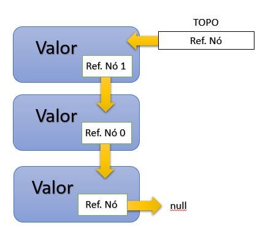

# Desenvolvimento básico em java

## Ambiente
-----------------------------------------------------------------------------------------------------------
### Maven e Gradle
=============================================================

#### O que é o Maven?
O Maven é uma ferramenta de código aberto mantida pela Apache. Trata-se de uma ferramenta de gestão de dependências e um task runner. Em outras palavras, o Maven automatiza os processos de obtenção de dependências e de compilação de projetos Java.

Quando criamos um projeto Maven, este projeto fica atrelado a um arquivo principal: o pom.xml. Neste arquivo POM (Project Object Model), nós descrevemos as dependências de nosso projeto e a maneira como este deve ser compilado. Com o Maven, é possível, por exemplo, automatizar a execução de testes unitários durante a fase de build, entre outras automatizações.

##### Com o Maven:
Não temos mais a necessidade de baixarmos as dependências de nosso projeto e as configurar dentro do Build Path/Classpath de nossas aplicações. Se nós precisamos do driver do MySQL, por exemplo, simplesmente registramos essa dependência no pom.xml. As ferramentas de automação do Maven irão detectar esta dependência, baixa-la e configura-la no Build Path/Classpath de nosso projeto.

#### O que é o Gradle?
Gradle é um sistema de automação de compilação de código aberto que se baseia nos conceitos de Apache Ant e Apache Maven e introduz uma linguagem de domínio específico (DSL) baseada em Groovy em vez do XML usado pelo Apache Maven para declarar a configuração do projeto.[2] Gradle usa um grafo acíclico dirigido ("DAG") para determinar a ordem em que as tarefas possam ser executadas.

Downloads:
	Gradle Build Tool
	Apache-mave-3.5.3
	Intellij IDE

O Gradle é um sistema de automação de build (compilação) open source que usa uma linguagem específica de domínio (DSL) em Groovy e Kotlin para definir tarefas. O Gradle foi projetado para automatizar o build de vários projetos. Ele também oferece suporte a builds incrementais, determinando quais partes do projeto já estão atualizadas, para que qualquer tarefa dependente dessas partes não seja executada novamente.

Para que o executável do Gradle fique visível na linha de comando do Windows, é necessário configurar a variável GRADLE_HOME e expô-la no Path do sistema. Copie o caminho completo onde o Gradle foi colocado por você.
Na janela que se abre, acesse a opção Configurações Avançadas do Windows
clique no botão Variáveis de Ambiente, no canto inferior direito da janela


===========================================================================
## IDEs : 
----------------------------------------


### INTELLIJ : 
==========================================================================

#### Alguns links indicados para estudo:
Português: http://www.basef.com.br/index.php/Atalhos_do_IntelliJ_Idea (Atalhos do IntelliJ)
Inglês: https://resources.jetbrains.com/storage/products/intellij-idea/docs/IntelliJIDEA_ReferenceCard.pdf
http://index-of.co.uk/Various/IntelliJIDEA_ReferenceCard.pdf

#### Plugins Sugeridos:
Rainbow Brackets | nyan - Barrinha colorida | GitToolBox  | Key Promoter X | One Dark Theme

------------------------------------
#### Teclas de atalhos

| Teclas                         | Ação                                                         |
| ------------------------------ | ------------------------------------------------------------ |
| Alt + insert                   | Abre menu opções (Criar classe, package, constructor, etc)   |
| Alt + Enter                    | Menu pop-up para escolher opções de correção (importar pacote, criar classe, etc) |
| Alt + Shift + Enter            | Importa Class                                                |
| Ctrl + N                       | Abre classe                                                  |
| Ctrl + B                       | Abre a classe em que o cursor estiver posicionado            |
| Ctrl + Shift + F10             | Já configura método e executa pela primeira vez Compila a classe aberta |
| Ctrl + Shift + F12             | Expande a tela                                               |
| Ctrl + Shift + /               | Altera seleção para bloco de comentário                      |
| Ctrl + /                       | Altera seleção para linhas comentadas com //                 |
| Ctrl + Alt + O                 | Apaga import´s não utilizados                                |
| Ctrl + Y                       | Remove linha                                                 |
| Ctrl + D                       | Duplica linha                                                |
| Ctrl + Shift + Seta cima/baixo | Move linha                                                   |
| Ctrl + Alt + V                 | Declara a variável na linha                                  |
| Ctrl + Alt + L                 | Indenta o código **                                          |
| Ctrl + K                       | Abri aba para commit                                         |
| Ctrl + F4                      | Fecha abas                                                   |
| Shift + F10                    | Já executa o método                                          |
| Shift + F6                     | Refatorar uma classe selecionada                             |
| Shift + F12                    | Estende área do Editor de texto                              |
| psvm                           | Forma curta de inserir o método main                         |
| sout                           | Forma curta de inserir o System.out.println()                |

-------------------------------------
#### Mark Point  +  Debug 'Classe.main()'

| Teclas           | Action           | Ação                      |
| ---------------- | ---------------- | ------------------------- |
| F8               | Step Over        | Passo externo             |
| F7               | Step Into        | Entrar                    |
| Alt + Shift + F7 | Force Step into  | Forçar entrada            |
| Shift + F8       | Step Out         | Sair                      |
| Alt + F9         | Run to Cursor    | Executar no cursor        |
| Ctrl + F5        | ReRun 'Class'    | reexecutar Debug          |
| F9               | Resume Programa  | Resumo                    |
| Ctrl + F2        | Stop 'Class'     | Parar Debug               |
| Ctrl+Shift+F8    | View Breakpoints | Visualizar os breakpoints |


-----------------------------------------------

### Eclipse : 

F2 ou (Alt + Shift = R) ==> Renomear o nome do pacote selecionado
Ctrl + N ==> Assistente de criação (project, Class)
Ctrl + M ==> Expande e retrai a tela
Ctrl + ==> Almenta a fonte
Ctrl - ==> Diminue a fonte
Ctrl + Shift + F ==> indenta o código 
Alt + Seta cima/baixo ==> move bloco selecionado para cima ou baixo
Shift + F2 ==> Refatorar uma classe selecionada
Ctrl + D ==> remove linha
Alt + Shift + Q ==> Exibir o consolo
Alt + Shift + X ==> Executar como Aplicação Java
Ctrl + 3 ==> Abre menu atalho para busca (Commands{Generate, git, debugs} | 
Menus | Preferences | help)


Ctrl + Shift + O ==> Import objeto


## Características da linguagem
-----------------------------------------------------------------------------------------------------------
### Etapa 6 - Generics em Java
=============================================================


Contexto:
- Evitar casting excessivo;
- Evitar códigos redundantes;
- Encontrar erros em tempo de compilação
- O recurso foi introduzido desde o Java SE 5.0

#### CORINGAS
---------
(Unboundled - Ilimitado):
Unknown Wildcards -> recebe uma lista genérica e exibir em um for 


(Bounded -):
UpperBounded Wildcard -> Coringas Ilimitados por cima(herdeiros) 
LowerBounded Wildcard -> Coringa limitado por baixo (não aceita herdeiros)

Convenção de caracteres:
K --> "key", exemplo: Map <K, V>
V --> "Value", exemplo: Map <K, V>
E --> "Element", exemplo: List<E>
T --> "Type", exemplo: Collections#addAll
? quando genérico


-----------------------------------------------------------------------------------------------------------
### Etapa 7 - Refatoração da Classe No
=============================================================

Código de exemplo de refatoração, utilizando uma classe simples e refatorar para uma classe Genérica, utilizando T(type)


## Aula 2 - PILHAS [LIFO: Last In, First Out]
═════════════════════════════════════════════════════════════
https://github.com/jrdutra/estruturaDeDadosJavaDio/tree/main/apresentacoes/Aula2

https://web.digitalinnovation.one/course/estrutura-de-dados-em-java/learning/7ec1fd61-497a-412a-b0ff-95ea3aca5f82?back=/browse

-----------------------------------------------------------------------------------------------------------
### Etapa 1 - Explicação teórica do conceito de Pilhas
=============================================================

Uma pilha de Livros é um exemplo, por seguir um comportamento que definimos como:

LIFO ══>
O último livro a entrar na pilha será o primeiro a sair.

Encadeamento de nó:

Espaço em memória que armazena o dado propriamente dito e uma referência para um próximo nó.

Nó é o conteinner ; o conteúdo é meu dado;  porta é número do próximo nó.


​

####Estrutura de dado pilha:
**Método Top**  - Refência do topo da pilha;

**Método Pop**  - Retira do topo, e a referência do topo passa para o nó de baixo como referência de topo;

**Método Push** - Cria o novo nó e seta o peyload, insire ele no topo da pilha e atribui a referência do topo anterior de baixo para ele e cria uma nova referência de top (Contrário do método Pop).

**Método isEmpty** - Verifica a referência de entrada se está nula (pilha vazia)

-----------------------------------------------------------------------------
Etapa 8 -  Explicação teórica do conceito de Pilhas

Etapa 9 - Utilização da Classe Pilha


## Aula 3 - PILHAS [FIFO: First In, First Out]
═════════════════════════════════════════════════════════════
https://github.com/jrdutra/estruturaDeDadosJavaDio/tree/main/apresentacoes/Aula3

Fila - O primeiro que chega é o primeiro a ser atendido

Nó é o conteinner e o conteúdo é meu objeto e porta é número do próximo nó

╔══════════════════╗						   ╔══════════════════╗
║					   ╔══════╗   ║							 ║                      ╔══════╗   ║
║	Object()	   ║ Ref. Nó  ║	 ║  ═ Ref. Nó ═►    ║	Object()        ║ Ref. Nó  ║   ║ ═══► null
║					   ╚══════╝   ║							 ║                      ╚══════╝   ║
╚══════════════════╝						   ╚══════════════════╝	

Métodos:
.enqueue() - inseri no final da fila e o nó fim de fila aponta para ele
.dequeue() - remove o primeiro da fila e o anterior aponta passa apontar para null 
.isempty() - verifica se nó é null


## Aula 4 - Listas Encadeadas
═════════════════════════════════════════════════════════════
https://github.com/jrdutra/estruturaDeDadosJavaDio/tree/main/apresentacoes/Aula4
possibilita a adição do nó em diversas posições na fila

Métodos: 
add() - possibilita a adição do nó em diversas posições na fila
remove() - remove o nó e a Ref.nó anterior passa a apontar para o posterior ao nó removido
.isEmpty()
.get() - pega a referência do nó desejado sem causar exclusão.

■■■■■■■■■■■■■■■■■■■■■■■■■■■■■■■■■■■■■■■■■■■■■■■■■■■■■■■■■■■■■■■■■■■■■■■■

## Classe
Por convenção as classes em java começam com letra Maiúscula e se for composto como exemplo -  AquilesRodrigues cada palavra inicia em letra maiúscula.

O método principal para executar um programa em java é:

**public static void main(String[ ] args) {   }**

**public**: modificador de acesso
**static**:  tipo de retorno
**void**: palavra reservada (sem retorno)
**main**: nome da classe
**String[ ] args**: assinatura do método (argumentos)
**{ }**: corpo do método

As classes possuem construtor que recebe  o mesmo nome da classe e fala como a classe irá ser construída.


### TIPOS de dados
------------------------------------------
Os tipos primitivos são aqueles que não são objetos.

O valor da variável "A" será copiado para a outra variável.
As atribuições em JAVA são por cópia de valor sempre;
Com tipo primitivo, copiamos o valor em memória;

Já com objeto é diferente, copiamos o valor da referência em memória e passamos para o outro objeto a ser duplicado.


#### Primitivos : 

byte ( 8bits, vlr_mín: -128, vlr_máx:127, default: 0);
short ( 16bits, vlr_mín: -32768, vlr_máx:32767, default:0);
int ( 32 bits, vlr_mín: -2147483648, vlr_máx:2147483647, default:0);
long(64 bits, vlr_mín: -9223372036854775808L, vlr_máx:9223372036854775808L, default: 0L, L:Long);
float(32 bits, vlr_mín: -0.5f, default: 0.0f, f: float);
double(formato:10.2456, default: 0.0d );
char ( 16bits, vlr_mín: 1 Caracter, default: '\u0000')
boolean(true, false, default: false)

Wrappers(não são primitivos)
Objetos primitivos Auto-boxing ══> [package java.lang] : Obs.: Estas classes podemos receber atribuição null e possuem métodos utilitários:
 Byte; Short; Integer; Long; Float; Double; Boolean
Exemplo:
Boolean confirma = Boolean.valueOf("true");

Objetos não-primitivos Unboxing ══> Atribuição de um tipo objeto para um tipo primitivo.
Exemplo:   int i = new Integer(3);


#### Não Primitivos

String - Sequência de caractares
Void - Objeto vazio
Number -  extende number
Object - objete
Qualquer outros objetos

#### Tipagem forte e estátitca

Tipagem Estática - os tipos da variável são verificados em tempo de compilação
Tipagem forte -  uma vez atribuído o tipo da variável ele não poderá ser modificado
Tipo Inferido -  Usando a palavra reservada **var** antes da atribuição da variável ele verifica o valor atribuído e declara a variável de acordo com o seu tipo.


### Modificador de acesso

**Public** - acessado de qualquer lugar, por qualquer entidade no projeto
**Private** -(atributos e métodos de classe) tudo só pode ser visto pela sua classe
**Protected** - acessível às classes do mesmo pacote ou através de Herança e seus métodos herdados não são acessíveis a outras classes fora do pacote em que foram declarados
default(padrão) - Acessíveis somente por classes do mesmo pacote, sua declaração não é definida um tipo de modificador, por isso o compilador resolve. 

----------------------------------------------------------

**Abstract** - (Ela não existe, ela cria uma ideia de algo) 
	Esse modificador não é aplicado nas variáveis, apenas em (CLASSES E MÉTODOS).
	Uma classe ABSTRATA não pode ser instanciada.
	Obs: Se houver alguma declaração de um método como abstract, a classe também deve ser marcada como abstract.

Exemplo:
```java

	public abstract class FormaGeometrica {
		public abstract String nome(); // ══> este método não tem corpo
	}
```
    --------------------------------------------------------------------------------------
```java
	public class Quadrado extends FormaGeometrica {
			@Override // ═══> sobrescrita(@Override) do método existente na classe FormaGeometirica
			public String nome() { 
				return nome; 
			}
	}
```
Já que não podemos instanciar uma classe abstrata, podemos estendê-la e seremos obrigados a sobrescrever(@Override) os métodos que não possuem assinatura.
Depois de estendê-la o que posso fazer?


**final**  FormaGeometrica   formaGeo  = new Quadrado("quadrado"); 

Mas, eu Não posso fazer:

final  FormaGeometrica   formaGeo  = new FormaGeometrica();


**Static** - O modificador é usado para criação de variáveis que poderá ser acessada por todas as instâncias de objetos desta classe, e quando seu conteúdo é modificado em alguma instância todas serão modificadas.

Obs: Não é necessários instanciar um objeto para ter acesso ao método da classe.

**Final** - O modificador de impedimento.
	Dependendo onde for colocado terá ações diferentes:
		Na Classe ══> não permite estender(extends) a classe;
		No método ══> não permite ser sobrescrito (@Override);
		Na Variável ══> não permite que o valor da variável seja alterado após a primeira atribuição.


### Interfaces (  @Override)
-----------------------------------------------

**Métodos abstratos** - Devem ser implementados por todos; Novos métodos quebram as implementações;
**Métodos default** - São herdados a todos que implementarem. Novos métodos não quebram as implementações;
**Herança múltipla** - implementa mais de uma interface ()
	
**Implementação** -  Quando uma classe implementa algo ele se torna aquele algo. 


### Enums
-----------------------------------------------

Basicamente é dicionário de dados imutáveis;
Não é permitido criar novas instâncias;
O construtor é sempre declarado como private;
Por convenção, por serem objetos constantes e imutáveis(static final), os nomes são em MAIÚSCULOS.
	

	Exemplo:
		public enum Status {
			Status.CLOSE.getCod()
		}

### Strings - pacote java.lang
-----------------------------------------------

	Strings é uma classe que representa uma sequencia de caracteres
	
	.charAt(5) ══> retorna a 5 posição do array de caracter:
	.length()  ══> Retorna o tamanho da string;
	.trim() ══> remove spaços em branco no início e no final da string
	.toLowerCase() ══> converte para minúscula
	.toUpperCase() ══> converte para Maiúscula
	.contains("x") ══> Retorna booleano se encontrar;
	.replace(origem, destino) ══> substitui;
	.equals("comparar") ==> Compara se string passada é igual a string do objeto;
	.equalsIgnoreCase(" ") ══> Ignora a espressão;
	.substring(posIncial,TotalRetorno) ══> retorna parte da string;
	.toCharArray() ══> ??????????????
	.concat() ══> ????????????
	.replaceAll() ══> ??????????
	.split() ══> 
	
	Formatador:
	.format("texto a ser exibido,  %s",  variável)  ══> utilizamos %s para informar onde será inserido valor da variável;
	.format(" Número:   %.2f   ") ══> informando que é float e com duas casas decimais após a vírgula;

### StringsBuilder
-----------------------------------------------

StringBuilder  
.append("texto a ser inserido") ══>  faz inserção de nova string;
.reverse() ══> retorna a string de traz para frente caracter por caracter;
.insert(pos, "caracter") ══> inseri caracter na posição informada;
Exemplo:
stringnome.insert(0, "A").insert(1, "quiles");


### Laços
-----------------------------------------------
For | While e Do/While


### Condicionais
-----------------------------------------------
IF e IF Ternário

Palavra reservada que verifica condições

```
final var letra = "B";
if ("A".equals(letra)) {
	System.out.println("Condição verdadeira, se A = B");
} else {
	System.out.println("Se não. Condição do else");
}

```


### Operadores
-----------------------------------------------
Igualdade | Lógicos | Incremental | Matemáticos | Relacionais


#### Matemáticos
```
System.out.println(0  + 1);
System.out.println(1  - 1);
System.out.println(2  * 1);
System.out.println(3  / 1 );
System.out.println(4 % 2); 	// Resto da divisão

```

#### Relacionais
```
final var numero = 6;
if (numreo >= 20) {
	System.out.println("O número é maior ou igual a 20");
}  else if (numero >= 10) {
	System.out.println(" O número é maior ou igual a 10 e menor que 20");
} else if (numero  <= 5) {
	System.out.println(" O número é menor ou igual a 5");
} else {
	System.out.println(" O número é maior que 5  e menor 10");
}
```

#### Lógicos
**Sort Circuit**  ══> Verifica a primeira condição e caso satisfaça, verificará a segunda 
&& ══> e  
||  ══>  ou 

**Non Sort Circuit**  ══> Verifica as duas condições independente se a a primeira é satisfatório 
& ══> e
|  ══>  ou 

```java
public class Condicionais {
    public static void main(String[] args){
    		final var numero = 6; //não permite que o valor da variável seja alterado após a primeira atribuição.
				final var letra = "B";
        System.out.println("Valores atribuídas as variáveis:");
        System.out.println("Número = "+numero+" e letra = "+letra);

        System.out.println("\n* Sort Circuit ══> if (numero &&  letra) ══> Se número e Letra forem verdadeiros\n═══════════════════════════════════════════");
        if (verifica(numero) && verifica(letra)) {
            System.out.println("As duas condições foram testadas e ambas são verdadeiras\n");
        }else {
            System.out.println("A primeira condição não é verdadeira, então a segunda não foi testada!\n");
        }
        System.out.println("\n* Non Sort Circuit ══> if (numero &  letra) ══> Se número e Letra forem verdadeiros\n═══════════════════════════════════════════");
        if (verifica(numero) & verifica(letra)) {
            System.out.println("As duas condições foram testadas e ambas são verdadeiras");
        }else {
            System.out.println("A primeira condição não é verdadeira, Independente disto a segunda foi verificada ");
        }
        /*
         * Lógico OU
         */
        System.out.println("\n************************************************************************************");
        System.out.println("\n* Sort Circuit ══> if (numero ||  letra) ══> Se número ou Letra for verdadeiro\n═══════════════════════════════════════════");
        if (verifica(numero) || verifica(letra)) {
            System.out.println("Opa!!! Validou! foi a 1ª ou a  2ª ?\n Vamos verificar!");
            if (verifica(numero)) {
                System.out.println("A 1ª condição é verdadeira, então a segunda que é String não foi testadaª\n");
            } else {
                System.out.println("A primeira condição não é verdadeira, por isso a segunda foi testada e é verdadeira!\n");
            }
        } else {
            System.out.println("As duas condições não são verdadeiras. Com o uso do operador lógico '||' Se  o 1º método é falso, o 2º também será verificado!\n");
        }
        System.out.println("\n* Non Sort Circuit ══> if (numero |  letra) ══> Se número ou Letra for verdadeiro \n═══════════════════════════════════════════");
        if (verifica(numero) | verifica(letra)) {
            System.out.println("Opa!!! Validou! Como não é Sort Circuit ambas sempre são validadas!\n Vamos verificar!");
            if (verifica(numero)) {
                System.out.println("A 1ª condição é verdadeira, mesmo assim a segunda que é String foi testadaª\n");
            } else {
                System.out.println("A primeira condição não é verdadeira, mas, ele sempre irá verificar as duas e a 2ª é verdadeira!\n");
            }
        }else {
            System.out.println("As duas condições não são verdadeiras. Lembrando que o uso do operador lógico '|' sempre as duas serão verificadas ");
        }
    }

    private static boolean verifica(String letra){
        System.out.println("Método Verificando se letra é equals 'A'...");
        return letra.equals("A");
    }
    private static boolean verifica(Integer numero){
        System.out.println("Método verificando se o número é menor que 5 ...");
        return numero < 5;
    }
}
```

